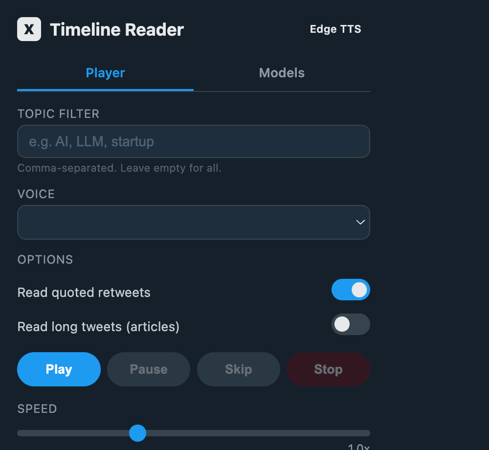
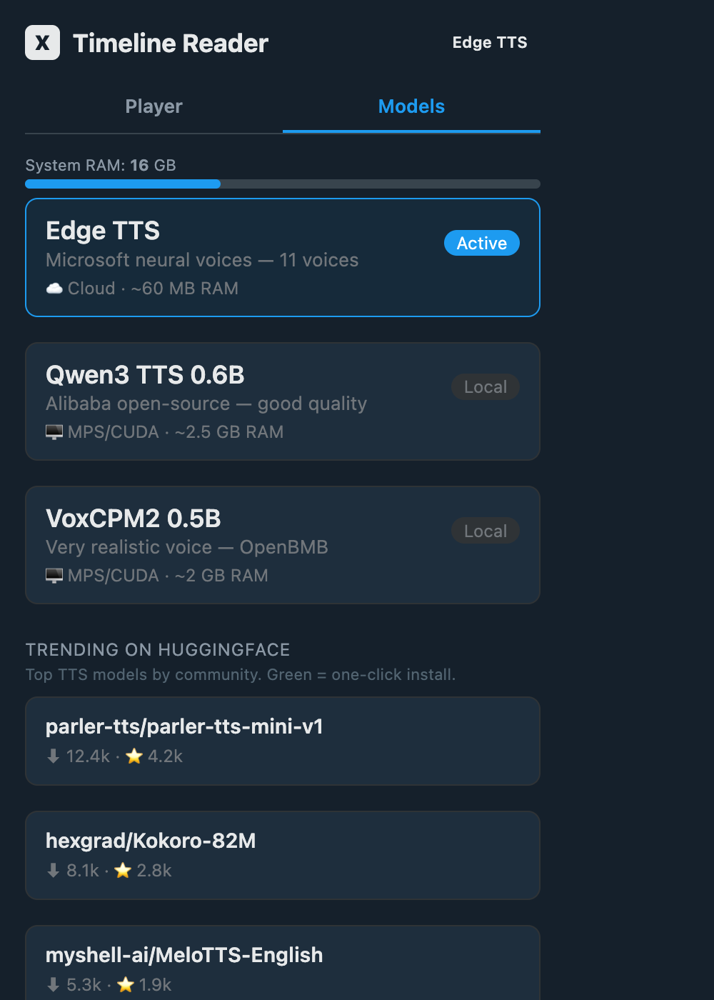

# X Timeline Reader

A Chrome extension that reads your X (Twitter) timeline aloud so you can listen in the background while working.

<p align="center">
  
  
</p>

## Why?

Scrolling X is a time sink. This extension turns your timeline into a podcast — you hear tweets read aloud with natural voices while you work, code, or cook. Filter by topic, skip the noise, and never miss what matters.

## Features

- **Podcast-style reading** — natural intros, transitions, and personality between tweets
- **Topic filtering** — only read tweets matching your keywords (e.g. `AI, startup, tech`)
- **Smart skipping** — automatically skips ads, promoted posts, paid partnerships, and video tweets
- **Scroll & highlight** — scrolls through your timeline tweet-by-tweet with visual highlight
- **Multiple TTS engines** — Edge TTS (cloud, default), Qwen3 TTS, VoxCPM2, or any HuggingFace model
- **Model marketplace** — browse trending HuggingFace TTS models and one-click install
- **Speed control** — 0.5x to 2.0x playback speed
- **Toggle options** — choose whether to read quoted retweets and long-form tweets
- **Auto "Show more"** — clicks expand buttons so it reads full tweet threads
- **Resource-friendly** — auto-unloads models after 5 min idle, server shuts down after 10 min
- **Download manager** — see cached models, their disk usage, and delete to free space

## Quick Start

### 1. Clone & set up the server

```bash
git clone https://github.com/ariediafauzan/x-timeline-reader.git
cd x-timeline-reader

python3 -m venv venv
source venv/bin/activate
pip install -r server/requirements.txt
```

### 2. Start the TTS server

```bash
./server/start_server.sh
```

The server runs on `http://localhost:8787` and auto-shuts down after 10 minutes of inactivity.

### 3. Load the Chrome extension

1. Open `chrome://extensions`
2. Enable **Developer mode** (top right)
3. Click **Load unpacked**
4. Select the **`extension/`** folder (not the project root)

### 4. Use it

1. Go to [x.com](https://x.com/home)
2. Click the extension icon
3. (Optional) Enter topic filters
4. Hit **Play**

## Architecture

```
┌─────────────────────────────────┐
│  Chrome Extension               │
│  ┌───────────┐  ┌────────────┐  │
│  │ content.js│  │ popup.html │  │
│  │ (on x.com)│  │  + popup.js│  │
│  └─────┬─────┘  └─────┬──────┘  │
└────────┼───────────────┼─────────┘
         │  HTTP :8787   │
         ▼               ▼
┌─────────────────────────────────┐
│  TTS Server (Flask)             │
│                                 │
│  ├─ Edge TTS     (cloud, fast)  │
│  ├─ Qwen3 TTS   (local, MPS)   │
│  ├─ VoxCPM2     (local, MPS)   │
│  ├─ HuggingFace (any model)    │
│  └─ Browser TTS (fallback)     │
└─────────────────────────────────┘
```

## TTS Engines

| Engine | Type | RAM | Quality | Speed | Notes |
|--------|------|-----|---------|-------|-------|
| **Edge TTS** | Cloud | ~60 MB | Great | ~1s | Default. Free, needs internet. 11 neural voices |
| Qwen3 0.6B | Local | ~2.5 GB | Good | ~5-10s | Alibaba open-source |
| Qwen3 1.7B | Local | ~7 GB | Great | ~15-30s | Best open-source quality. Needs 16 GB+ RAM |
| VoxCPM2 | Local | ~2 GB | Great | ~20-30s | Very realistic. Pre-buffers next tweets |
| HuggingFace | Local | Varies | Varies | Varies | One-click install from trending list |
| Browser | Built-in | 0 | Basic | Instant | Fallback when server is offline |

Switch engines from the **Models** tab in the popup. The extension shows RAM recommendations and warns if a model is too heavy for your system.

## Requirements

### Minimum (Cloud TTS — works on anything)

| Component | Requirement |
|-----------|-------------|
| Browser | Chrome, Brave, Edge, or any Chromium-based browser |
| Python | 3.10+ (3.12 recommended) |
| RAM | 512 MB free (server idles at ~60 MB) |
| GPU | None |
| Internet | Required (Edge TTS streams from Microsoft) |
| OS | macOS, Linux, Windows |

Edge TTS uses Microsoft's neural voices. It works on any CPU — Intel, AMD, Apple Silicon, even a Raspberry Pi. No GPU, no model downloads, no disk space. Just needs internet.

### Recommended (Local TTS models)

| Component | Requirement |
|-----------|-------------|
| RAM | 8 GB minimum, **16 GB+ recommended** |
| GPU | Apple Silicon (M1/M2/M3/M4) with MPS, or NVIDIA with CUDA 12+ |
| Disk | 3–10 GB per model (cached in `~/.cache/huggingface/hub/`) |
| OS | macOS (Apple Silicon) or Linux (NVIDIA) |

> **Resource management:** Local models load on-demand and auto-unload after 5 min idle. The server shuts down entirely after 10 min of no requests. Your machine is not impacted when you're not using the extension.

### No GPU? No problem.

The default engine (Edge TTS) sounds great and needs zero GPU. Local models are entirely optional — for users who want offline/private TTS or want to experiment with open-source voices.

## Optional Setup

### Auto-start server on login (macOS)

```bash
# Edit the plist to point to your install path, then:
cp server/com.xreader.tts.plist ~/Library/LaunchAgents/
launchctl load ~/Library/LaunchAgents/com.xreader.tts.plist
```

The server starts on login, auto-shuts down after 10 min idle, and only restarts on crash.

### Auto-start from Chrome (Native Messaging)

Let the extension auto-launch the server when you open X:

```bash
./server/setup_native_host.sh
```

Prompts for your Chrome extension ID (from `chrome://extensions`).

### Install local TTS engines

```bash
source venv/bin/activate
pip install qwen-tts    # Qwen3 TTS (Alibaba)
pip install voxcpm      # VoxCPM2 (OpenBMB) — very realistic voice
```

## Project Structure

```
├── extension/                  # Chrome extension (load this in chrome://extensions)
│   ├── manifest.json           #   Extension manifest v3
│   ├── content.js              #   Tweet extraction, TTS playback, scrolling
│   ├── popup.html              #   Popup UI (dark X theme)
│   ├── popup.js                #   Popup controller (playback, models, downloads)
│   └── icons/                  #   Extension icons
├── server/                     # TTS backend
│   ├── tts_server.py           #   Multi-engine Flask TTS server
│   ├── start_server.sh         #   Server launch script
│   ├── native_host.py          #   Native Messaging host for auto-start
│   ├── setup_native_host.sh    #   Native host installer
│   ├── com.xreader.tts.plist   #   macOS Launch Agent template
│   └── requirements.txt        #   Python dependencies
├── docs/                       # Screenshots and assets
├── CHANGELOG.md
├── LICENSE                     # MIT
└── README.md
```

## How It Works

1. **Content script** (`content.js`) runs on x.com, extracts tweets from the DOM via `article[data-testid="tweet"]`, filters out ads/videos/promoted posts, and manages the reading queue.

2. **Popup** (`popup.html` / `popup.js`) provides playback controls, topic filtering, voice selection, speed slider, and a model management UI with trending HuggingFace models.

3. **TTS server** (`tts_server.py`) receives text via `POST /speak`, synthesizes speech through the active engine, and returns audio (MP3 or WAV). Supports engine switching, model downloads, and cache management via REST API.

4. The content script plays the returned audio, scrolls to the next tweet, highlights it, and repeats.

### Key technical details

- **Race condition prevention** — `state.speaking` mutex prevents concurrent `speakNext()` calls from reading two tweets simultaneously
- **Pre-buffering** — for slow local models, upcoming tweets are sent to `POST /prebuffer` and generated in a background thread while the current tweet plays
- **Audio cache** — LRU cache (20 entries) keyed by `text|speaker|rate` hash; repeated text returns instantly
- **Auto resource management** — idle watcher thread unloads models after 5 min and exits the server process after 10 min
- **Graceful fallback** — if the server is unreachable, falls back to browser `SpeechSynthesis` API

## Troubleshooting

| Problem | Fix |
|---------|-----|
| No sound | Check server is running: `curl http://localhost:8787/health` |
| "Server offline" in popup | Run `./server/start_server.sh` or set up auto-start |
| Robotic voice | Make sure you're on Edge TTS, not Browser fallback |
| Model download stuck | Check internet connection; try a different model |
| High RAM usage | Switch to Edge TTS (cloud); local models unload after 5 min idle |
| Port 8787 in use | `lsof -ti:8787 \| xargs kill -9` then restart |
| Extension not working on X | Reload the extension in `chrome://extensions` |

## API Reference

The TTS server exposes these endpoints:

| Endpoint | Method | Description |
|----------|--------|-------------|
| `/health` | GET | Server status, active engine, RAM usage |
| `/speak` | POST | Synthesize speech. Body: `{text, speaker, rate}` |
| `/prebuffer` | POST | Queue texts for background generation. Body: `{texts[], speaker, rate}` |
| `/engines` | GET | List available engines with RAM recommendations |
| `/engine` | POST | Switch engine. Body: `{engine}` |
| `/trending` | GET | Trending HuggingFace TTS models |
| `/load-hf` | POST | Download & load a HuggingFace model. Body: `{model_id}` |
| `/download-progress` | GET | Poll download progress |
| `/cached-models` | GET | List downloaded models with sizes |
| `/cached-models/:id` | DELETE | Delete a cached model |

## Contributing

PRs welcome. Some ideas:

- [ ] Firefox extension support
- [ ] Windows/Linux auto-start (systemd, Task Scheduler)
- [ ] More built-in engines (Kokoro, Parler, Bark)
- [ ] Voice cloning with VoxCPM2
- [ ] Bookmark/save interesting tweets while listening
- [ ] Read Twitter Spaces transcripts
- [ ] Multi-language support
- [ ] Chrome Web Store publishing

## License

[MIT](LICENSE)
